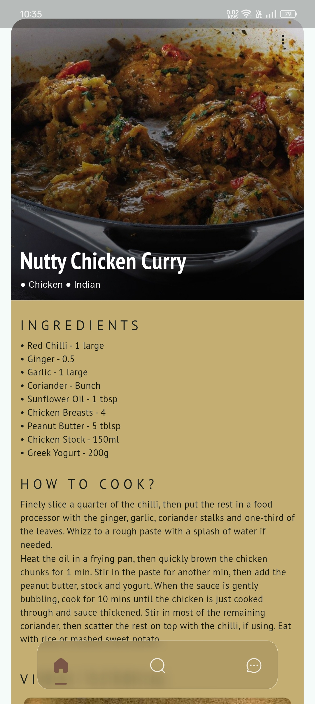
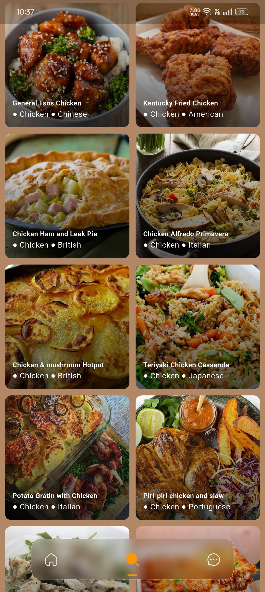
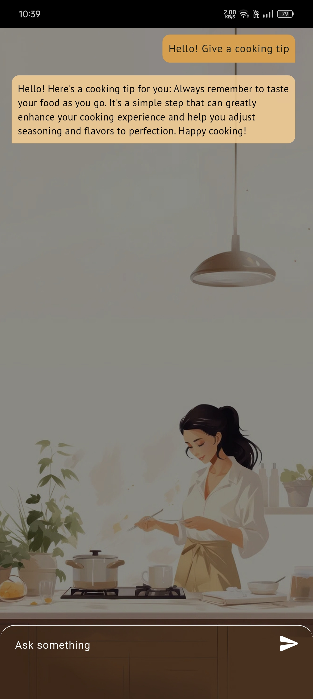

# SavourAI

<p align="center">
  <a href="https://flutter.dev"></a>
  <a href="https://developer.android.com"></a>
  <a href="LICENSE"></a>
</p>


SavourAI is a beautiful Flutter application that delivers a dynamic, swipeable feed of random meals using [TheMealDB API](https://www.themealdb.com/api.php). Think of it as a Reels-style food discovery experience, complete with YouTube recipe links, ingredient lists, and more!

---


##  Features
-  Personal Assisted Chatbot
-  Reels-like horizontal scrolling of meals
-  Auto-extracted background color from meal image
-  YouTube link integration for each recipe
-  Ingredients and instructions display
-  Infinite scroll with dynamic meal loading

---


## Demo
<p align="center">
  

</p>


---

##  Screenshots

### Detailed recipes and video tutorials
<div>
  
  
  
</div>

### Dynamic Meal Search
<div>
        
      
            

</div>

### Assisted Chatbot and Consent Page
<div>
          
                   

</div>

---

##  Tech Stack

- Flutter
- Dart
- TheMealDB API
- palette_generator for dominant image color
- http for API calls

---

##  Direct APK Download 
<a href="https://github.com/Dheeraj-Chintala/Savour-AI/releases/tag/v1.0.0" download>
  
</a>

---
## OR  Getting Started

1. Clone the repo
   ```bash
   git clone https://github.com/Dheeraj-Chintala/Savour-AI.git
   cd Savour-AI
2. Get dependencies
   ```bash
   flutter pub get
3. Run
   ```bash
   flutter run
